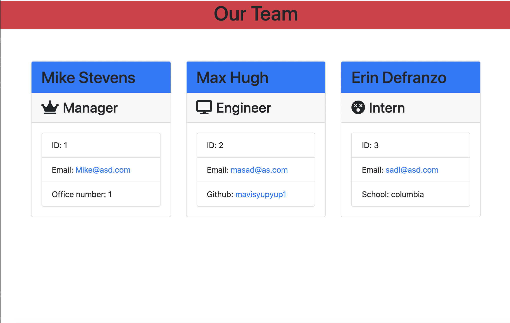

# team-profile-generator
## Description
This is a Node.js command-line application that takes in information about employees on a software engineering team and generates an HTML webpage that displays summaries for each person. Your application should use [Jest](https://jestjs.io/) for running the unit tests and [Inquirer](https://www.npmjs.com/package/inquirer) for collecting input from the user. 
## Built With
* Node.js
* Jest
* NPM Inquirer
* HTML
* Bootstrap

## Installation
* Download or clone repository
* Node.js is required to run the application
* `npm` install to install the required npm packages
## Usage
The application will be invoked by using the following command:
``` 
node index.js 
```
Users will be prompted to enter information about:  
* manager
* engineer 
* intern

Once the information has been entered and validated, a webpage will be generated and can be viewed in the dist folder.
## Demo
[walk_though_vide](https://watch.screencastify.com/v/ZD5TuCiDpRTURUuTy10F)


## License
MIT License

Copyright (c) 2021 Grace Liu

